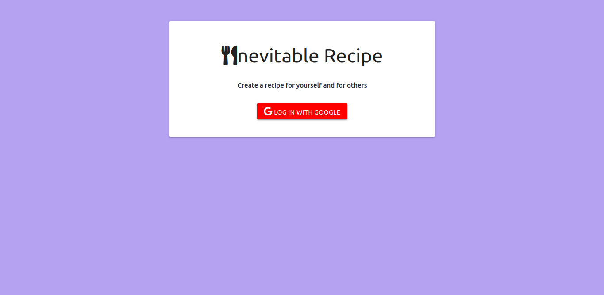

# Inevitable-Recipe
A web application built using Nodejs, Express, MongoDB, Passport. Inevitable Recipe app is Recipe book, that allows users to share their recipe online. The application
consist of webpages that include Login page, Dashboard, Add recipe page, public recipes page and view recipe page. 

### Key Features of this applications 
- Login using Google account
- User can view his/her recipe 
- User can add a recipe in public or private mode
- User can view all public recipe

### Technical Details
- User is authenticated by google-oauth-2.0 api using Google Passport Strategy
- Session is stored in MongoDB database using connect-mongo
- Users data and recipes are stored in MOngoDB database.
- Express Handlebars is used for dynamically handling HTML contents
- Materialize css and awesome-fonts used for designing purpose
